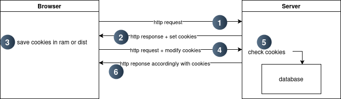

# Learning Web Development in Ruby
### Content
1. Ruby
   * Mise
      A environment manager to handle multiple programming languages and its versions.
   * Bundler
      A dependency manager for Ruby projects to ensure consistent gem versions.
   * Gem
      Ruby libraries packaged for distribution; managed with the gem command.
   * Class
      Defines the blueprint for objects.
     - inheritance : Enables classes to inherit behavior from     parent classes. eg. ruby/vihicle.rb
     - contructor : The initialize method, called automatically when creating an object. eg. ruby/person.rb
     - getter and setter : Methods to access or modify object attributes; can use attr_accessor. eg. ruby/book.rb
     - Singleton :  Ensures a class has only one instance. eg. singlerb
     - Super() : Calls the method of the same name from the parent class. eg. ruby/shape.rb
     - Self : Refers to the current instance or class context. eg. ruby/self.rb
   * Object
      An instance of a class, encapsulating data and methods.
   * Method
      Reusable code blocks defined with def.
     - bang method : Ends with !, indicating it modifies the caller. use for raising the error. eg. ruby/b.rb
     - predicate method : Ends with ?, returning a boolean.
     - undef : Removes a method from a class or module.
     - alias : : Creates a new name for an existing method.
   * Variable (a, @a, @@a, $a, A)
     - local variable : Scoped within a block or method.
     - intance variable : Scoped to an object instance.
     - class variable : Shared across a class and its instances.
     - global variable : Available everywhere.
     - constant : Immutable variables with global scope.
     eg. ruby/Car.rb
   * Module
      A collection of methods and constants, used for mixins and namespaces. eg. ruby/greet.rb
   *  Include: Mixes module methods into a class.
   * Prepend: Adds module methods before existing methods.
   * Require: Loads external libraries or Ruby files.
   * Access control
     - public : Accessible from anywhere.
     - private : Accessible only within the defining class.
     - protected : Accessible by instances of the same class or subclasses.
     eg. ruby/ac.rb
   * hash
     - symbol vs string in hash : Symbols are immutable and memory-efficient for keys while string are mutable. access accordingly to how you define.
   * missing method : Handles undefined methods dynamically using method_missing.
   * Block: Anonymous code passed to a method. eg. ruby/block.rb
   * Lambda: A stricter anonymous function.
   * Proc: Similar to a lambda but less strict with arguments.
   * downto / upto : Iterators for decrementing/incrementing in loops. eg. 5.downto(1)
   * if / unless : Conditional expressions;
   * while / until : Looping constructs; 
   * $LOAD_PATH << "." : Adds a directory to Ruby's library search path.
   * next: Skip to the next iteration.
   * break: Exit the loop.
   * redo: Restart the current iteration.
   * retry: Retry the entire loop (deprecated).
   * raise: Raise an exception.
   * exception handling
     - begin : Code that might raise an exception
     - rescue ExceptionType => variable : Code to handle the exception
     - else : Code to execute if no exception occurs
     - ensure : Code that will always execute (e.g., cleanup)
3. Client-Server Architecture
4. Domain name
5. HTTP request & reponse
  * webrick
  * rack
  * sinatra
  * puma
7. Web server & Application server

8. Storage
  * Local Storage: Persistent key-value storage in the browser.
  * Session Storage: Temporary key-value storage per browser tab.
  * Cache Storage: Stores HTTP responses for offline or faster access.
  * Indexed DB: A low-level database for structured data in browsers.
  * Private State Token: Stores private, origin-specific client data.
10. HTTP cookies
  * Signed vs Unsigned Cookies: Signed cookies ensure integrity using a cryptographic signature.
  * Persistent vs Session Cookies: Persistent cookies have an expiration date; session cookies last until the browser closes.
  * Zombie Cookies: Persistent cookies that regenerate after deletion.
  * First-Party vs Third-Party Cookies: First-party cookies belong to the site you're visiting; third-party cookies come from external domains.
  * Secure Cookies: Transmitted only over HTTPS.
  * HttpOnly Cookies: Inaccessible to JavaScript for security.
  * SameSite Attribute: Restricts cross-site cookie behavior (Strict, Lax, None).
  
11. Cache
   

